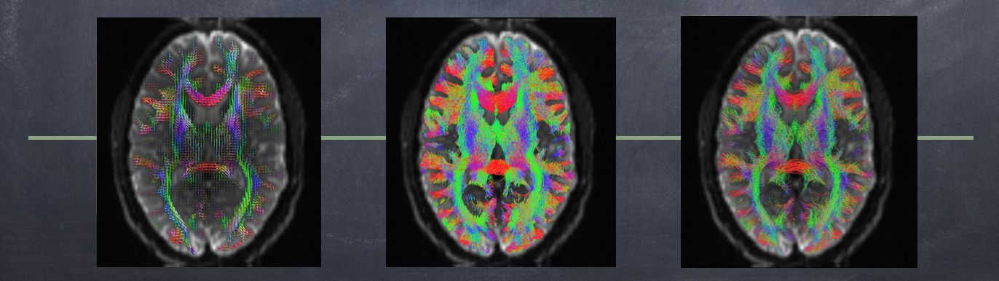
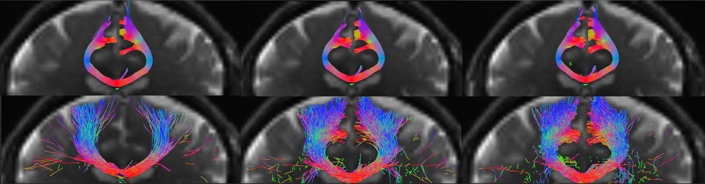

# My BrainHack project: TRAMPOLINO (TRActography Meta-Pipeline cOmmand LINe tOol)

*Check the official repository for [TRAMPOLINO](https://github.com/matteomancini/trampolino) and try it out:* `pip install trampolino`

### Project definition

I chose to focus my project on diffusion MRI and tractography. Reconstructing white matter fibre bundles in vivo has a tremendous potential both for better understanding the brain as a complex system and for clinical applications. Although many algorithms and approaches have been proposed so far, there are still issues in terms of false positive, and given the very different implementations and the potential influencing factors, it is hard to easily compare different pipelines and clarify the effects of the different parameters. Therefore, my goal was to build a meta-pipeline tool that would allow to implement a given workflow interfacing with several software toolboxes available and offering an easy way to explore the influence of the parameters on the final outcome. I decided to break down any given pipeline in three fundamental steps: reconstruction, where the diffusion data are used to estimate a tensor representation or to fit a fibre orientation distribution by means of more complex approaches (e.g. spherical harmonics, Q-ball); tracking, where streamlines are reconstructed from the fibre orientation distribution using a chosen algorithm, which may be deterministic or probabilistic; and filtering, where the spurious streamlines are removed on the basis of anatomical priors or with data-driven methods.

### Learning experience

To implement a modular and extensible tool, I chose to use the Python programming language and the Nipype package, which allowed me to build on top of already existing interfaces to common tractography software toolboxes. Although some workflows are also already available, they are quite outdated. To assemble new workflows, I used Giraffe Tools and Porcupine: in this way it was possible to easily build a first reconstruction pipeline just by assembling the interface blocks. This was my first attempt to build an actual entire application in Python, so as a starting point I chose to use the Cookiecutter package to start working on a minimal template for general Python packages. I never used such a package but it was relatively straightforward. To handle the meta-pipeline using a command line interface (CLI), I decided to use the Click package, which was new to me. The Click package allow to easily build a modular CLI and handle multiple subcommands. Finally, to make my tool available to the general public, I decided to create a dedicated Github repository and to upload the final package to the Python Package Index, so anyone would be able to install it using the popular pip tool.

### Results
The tool, called TRAMPOLINO (TRActography Meta-Pipeline cOmmand LINe tOol), is available on https://github.com/matteomancini/trampolino and can be easily installed typing in a terminal: `pip install trampolino`. An example of complete command is the following:

> trampolino -w /home/me -n results recon -i dwi_series_cor.nii -v bvecs -b bvals mrtrix_msmt_csd track mrtrix_tckgen filter mrtrix_tcksift

TRAMPOLINO is fully modular, so it is possible for example to run just one of the steps (e.g. just tracking). There are specific options to perform tractographies with different parameters, for example the angular threshold and the algorithm. 

The following filtering step is then performed on all of the tractography results. Another option is the one related to ensemble tractography: it is possible to combine together the streamlines in one single tractography and proceed with the filtering with that one. So far, I implemented just one option for each of the pipeline steps, interfacing the MRtrix software. Since the related MRtrix interface as implemented in Nipype had a few bugs, I corrected them and sent a pull request to the Nipype project on Github. In the meantime, I inserted the corrected code for the MRtrix interface directly in TRAMPOLINO. Future work will include adding more workflows and building containers with the required software packages.
