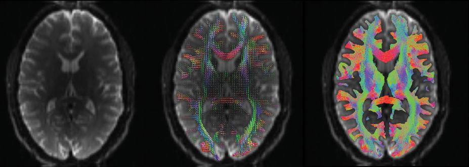

# iron-meta-pipeline

*Adapted from wikipedia: https://en.wikipedia.org/wiki/File:Thanos_and_Infinity_Gems.jpg*

**What is this?** A general pipeline to generate tractography from diffusion MRI data.

**Another one??** The idea is to build a meta-pipeline able to embed the processing workflow, relying on existing tools without reinventing the wheel.

**Why?** Mainly to allow anyone with diffusion data to run one of many pipelines used in papers or in previous tractography challenges.

**How?** The workflows will be developed using Nipype and Giraffe tools, and the whole thing will be assembled in Boutiques in order to have an easy way to describe inputs, processing steps and outputs.

**Well, that's it?** As a first concrete application, this pipeline will be used to create a submission to the IronTract challenge! Stay tuned for the results!

## Main goals

- Build a modular pipeline that can be used to compute tractography from diffusion data;
- Provide an easy-to-use way to build your own workflow;
- Pave the way for inter-pipeline comparisons and parameter-dependencies in one unique system;

## Tools

- Nipype;
- Giraffe tools;
- Jupyter;
- Boutiques.

## Project deliverables

- Command-line software to reconstruct tractography from diffusion data with the freedom of choosing preprocessing steps, tracking algorithms and filtering post-processing;
- Jupyter notebook to show the different outcomes from the most used pipelines;
- Implementing the pipelines used for the previous ISMRM Tractography Challenge (details published in Maier-Hein et al. 2017).

## To-do list

- [x] Create a sketch of how the system would work;
- [ ] Create first workflows for pre-processing, tracking and filtering;
- [ ] Design a way to easily combine the specific workflows in a meta-workflow;
- [ ] Embed the system in Boutiques;
- [ ] Test it!
- [ ] Assemble the pipeline for the IronTract Challange;
- [ ] Submit the results;
- [ ] Fingers crossed!

## Open issues

-- stay tuned (because there will be!) --

## Brief background

Every tractography pipeline can be summerized in three steps:

1. Pre-processing/modelling: the diffusion data is pre-processed to remove artifacts and subsequently represented as a tensor or modelled using more complex approaches (e.g. spherical harmonics, Q-ball), obtaining a fiber orientation distribution (FOD);
2. Tracking: the FOD is then used to reconstruct potential trajectories of the streamlines; each specific algorithm uses either a deterministic or a probabilistic approach;
3. Filtering: the tractography is then filtered to remove spurious streamlines (e.g. by means of clustering).

During these steps, additional constraints and priors are used during the tracking and filtering stages.
One example of this organization is given in the supplementary materials of Maier-Hein et al. 2017 , where each pipeline in the challenge is briefly described. However, given the different tools used in each case, it is difficult to reproduce those pipelines and compare them on a different dataset or with different parameters. This pipeline would allow to use one framework keeping the freedom to choose any tool.

## About me

I am a postdoctoral fellow at Polytechnique Montréal, where I am working on a multi-site fellowship project on myeling mapping. My PhD dissertation was on brain connectivity, specifically using networks models and graph measures to characterize non-invasive brain stimulation. I spent the last two-years as a research associate at UCL working on the topics of tractography and multimodal imaging.

## References

Maier-Hein et al. (2017) The challenge of mapping the human connectome based on diffusion tractography. Nature Communications 8: 1349.

