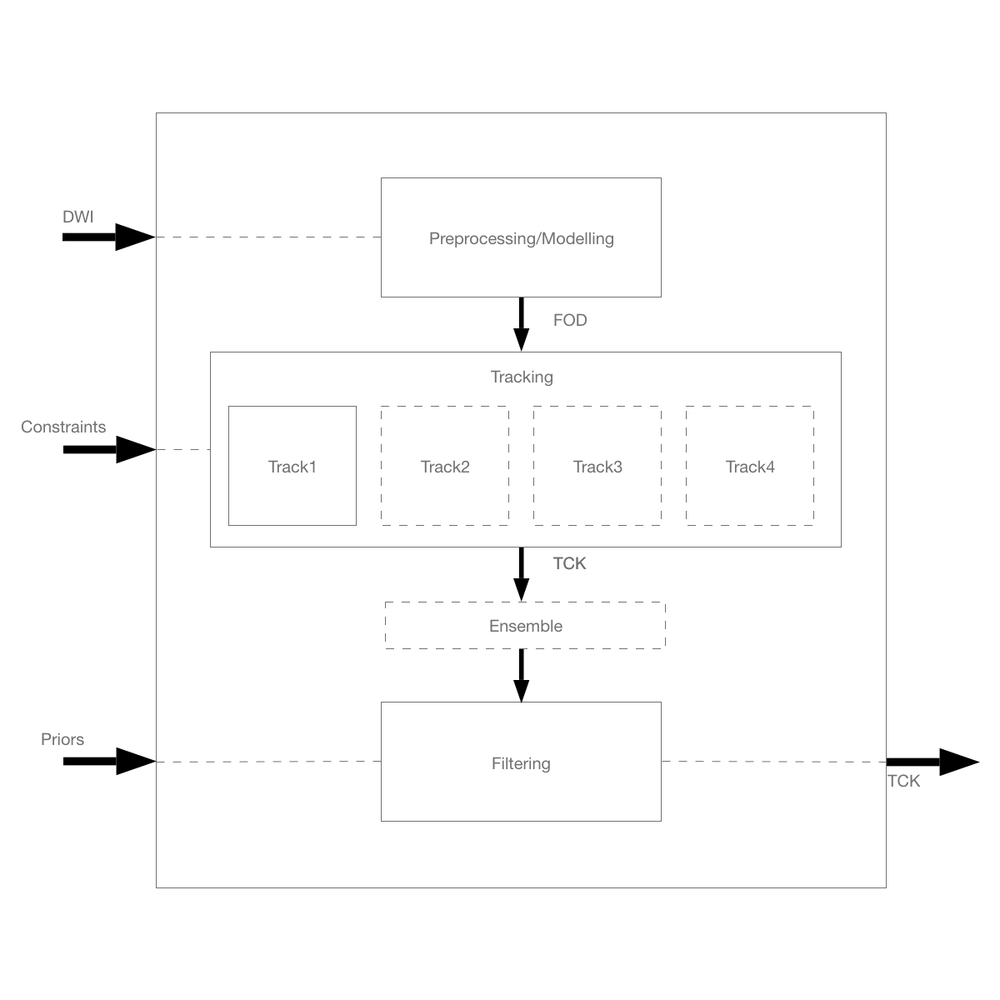

# iron-meta-pipeline

**What is this?** A general pipeline to generate tractography from diffusion MRI data.

**Another one??** The idea is to build a meta-pipeline able to embed the processing workflow, relying on existing tools without reinventing the wheel.

**Why?** Every tractography pipeline can be summerized in three steps:
1. Pre-processing/modelling: the diffusion data is pre-processed to remove artifacts and subsequently represented as a tensor or modelled using more complex approaches (e.g. spherical harmonics, Q-ball), obtaining a fiber orientation distribution (FOD);
2. Tracking: the FOD is then used to reconstruct potential trajectories of the streamlines; each specific algorithm uses either a deterministic or a probabilistic approach;
3. Filtering: the tractography is then filtered to remove spurious streamlines (e.g. by means of clustering).
During these steps, additional constraints and priors are used during the tracking and filtering stages.
One example of this organization is given in the supplementary materials of Maier-Hein et al. 2017, where each pipeline in the challenge is briefly described. However, given the different tools used in each case, it is difficult to reproduce those pipelines and compare them on a different dataset or with different parameters.

**How?**

## Main goals

## To-do list

- [x] uhm
- [ ] ehm
- [ ] ah!

## Open issues

## About me

I am a postdoctoral fellow at Polytechnique Montréal, where I am working on a multi-site fellowship project on myeling mapping. My PhD dissertation was on brain connectivity, specifically using networks models and graph measures to characterize non-invasive brain stimulation. I spent the last two-years as a research associate at UCL working on the topics of tractography and multimodal imaging.

## References

